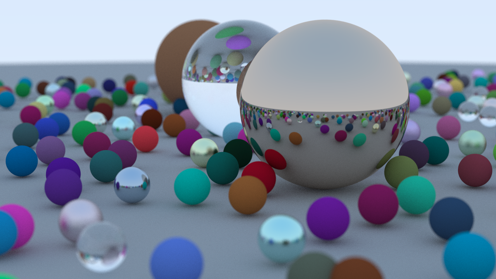

## Ray Tracer

A simple ray tracer written in Rust and based on the book [Ray Tracing in One Weekend](https://raytracing.github.io/books/RayTracingInOneWeekend.html)

## Run the Project

```bash
cargo run --example spheres-big-scene
```

You should get an image like the following:



Note: This might take some time to run, a progress bar is provided to anticipate the general render time.

## Notes on Optimization

Currently running the complex scene at:
